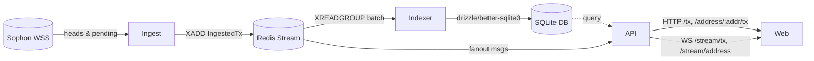
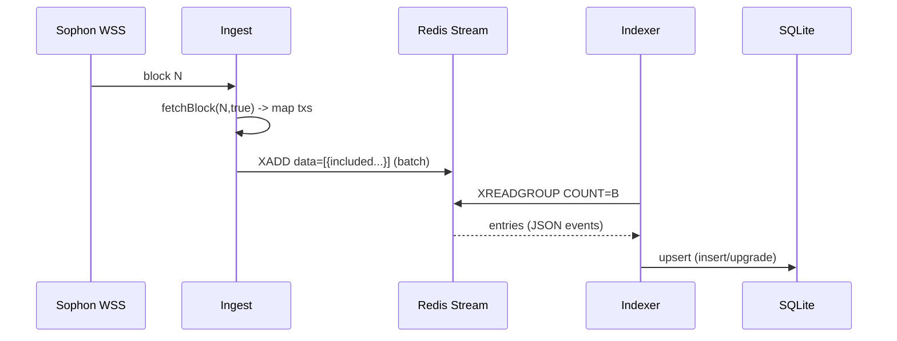

<!-- Generated deep-dive doc. Export to PDF if needed. -->

## Sophon Streamer — Technical Deep Dive

### Goals
- High-signal walkthrough of ingestion and API contracts/pagination
- Clear architecture diagrams, precise contracts, and presenter notes

---

## 1) System Overview

Sophon Streamer ingests realtime Ethereum (Sophon) transactions via WS, enriches and persists them, and exposes HTTP/WS APIs for dashboards.



Key responsibilities
- Ingest: Connect to WSS for blocks and pending hashes; map to events; enqueue to Redis stream.
- Indexer: Consume Redis with consumer groups; upsert into SQLite; compute metrics.
- API: Cursor-paginated REST over SQLite; WS fanout of pending/included; optional Socket.IO.
- Web: Next.js dashboard using HTTP for bootstrapping and WS for live updates.

---

## 2) Ingestion Pipeline

### Sources and mapping
- Heads channel: subscribe to `provider.on('block')`; for each block, fetch full tx list and map to `included` events with timing.
- Pending channel: raw WS `eth_subscribe: newPendingTransactions`; map to `pending` events with firstSeenMs.

Configuration
- `apps/ingest/src/config.ts` controls RPC URLs, Redis, stream name, backoff caps, and port.
- Required: `SOPHON_WSS`, `SOPHON_HTTP`
- Optional: `REDIS_URL` (default `redis://127.0.0.1:6379`), `INGEST_STREAM` (default `ingest:tx`)

Code references:
```20:45:apps/ingest/src/wsClient.ts
  private async startHeadsLoop() {
    const provider = new WebSocketProvider(this.wssUrl);
    provider.on('block', async (blockNumber: number) => {
      const seenAtMs = Date.now();
      const batch = await this.fetcher.fetchBlockByNumberAndMap(blockNumber, seenAtMs);
      await publish(batch);
    });
  }
```

```61:90:apps/ingest/src/wsClient.ts
  private async startPendingLoop() {
    const ws = new WebSocket(this.wssUrl);
    ws.on('open', () => ws.send(JSON.stringify({
      jsonrpc: "2.0", id: 1, method: 'eth_subscribe', params: ['newPendingTransactions']
    })));
    ws.on('message', (buf) => {
      const msg = JSON.parse(String(buf));
      if (msg.method === 'eth_subscription' && msg.params?.result) {
        publish([{ status: 'pending', hash: msg.params.result, firstSeenMs: Date.now() }]);
      }
    });
  }
```

```10:36:apps/ingest/src/blockFetcher.ts
async fetchBlockByNumberAndMap(num: number, seenAtMs: number): Promise<IngestedTx[]> {
  const block = await this.http.getBlock(num, true);
  const includedAtMs = Date.now();
  return block.transactions.map((tx) => ({
    status: 'included', hash: typeof tx==='string'? tx: tx.hash,
    firstSeenMs: seenAtMs, includedBlock: Number(block.number), includedAtMs,
    from: typeof tx==='string'? null : (tx.from ?? null),
    to: typeof tx==='string'? null : (tx.to ?? null),
    valueWei: typeof tx==='string'? '0' : String(tx.value ?? '0'),
    feeWei: typeof tx==='string'? null : (tx.maxFeePerGas ? String(tx.maxFeePerGas) : null),
  }));
}
```

### Queueing contract (Redis Stream)
- Stream name: `CFG.stream` (default `ingest:tx`).
- Producer adds each event as JSON in field `data` via `XADD`.

```11:21:apps/ingest/src/queue.ts
export async function publish(batch: IngestedTx[]): Promise<void> {
  const pipeline = redis.pipeline();
  for (const e of batch) {
    pipeline.xadd(STREAM, '*', 'data', JSON.stringify(e));
  }
  await pipeline.exec();
}
```

### Sequence (heads path)


### Resilience & backoff
- Exponential reconnect with cap for both heads and pending loops.
- At‑least‑once delivery: Redis stream + consumer groups; idempotent DB upserts by primary key `hash`.
- Metrics: connection gauges, counters, and latency histograms.
- Pending path safeguards: if provider disallows `newPendingTransactions`, the client logs and closes; reconnect backoff applies.

---

## 3) Indexer and Data Modeling

### Consumer group processing
```21:46:apps/indexer/src/redisConsumer.ts
await redis.xreadgroup('GROUP', CFG.group, CFG.consumer, 'COUNT', CFG.batchSize, 'BLOCK', 5000, 'STREAMS', CFG.stream, '>');
// parse JSON from field 'data', invoke onBatch, then XACK
```

### Upsert semantics and schema
```13:29:apps/indexer/src/index.ts
await db.run(sql`CREATE TABLE IF NOT EXISTS transactions (...)`);
await db.run(sql`CREATE INDEX IF NOT EXISTS idx_tx_time ...`);
```

```45:76:apps/indexer/src/index.ts
await db.insert(transactions).values({...}).onConflictDoUpdate({
  target: transactions.hash,
  set: { status: 'included', includedBlock: ..., firstSeenMs: MIN(first_seen_ms, :new) }
});
```

Schema (SQLite / Drizzle):
```1:14:apps/indexer/src/schema.ts
export const transactions = sqliteTable('transactions', {
  hash: text('hash').primaryKey(),
  firstSeenMs: integer('first_seen_ms').notNull(),
  status: text('status', { enum: ['pending','included','dropped'] }).notNull(),
  includedBlock: integer('included_block'),
  includedAtMs: integer('included_at_ms'),
  fromAddr: text('from_addr'),
  toAddr: text('to_addr'),
  valueWei: text('value_wei'),
  feeWei: text('fee_wei'),
});
```

### Guarantees
- Primary key `hash` ensures idempotency.
- Upgrade path preserves earliest `firstSeenMs` using `MIN()` during included upgrade.

Config
- `apps/indexer/src/config.ts` — `REDIS_URL`, `INGEST_STREAM`, `INDEXER_GROUP`, `CONSUMER_NAME`, `CONSUME_BATCH`.
- DB path from `apps/indexer/src/db.ts` uses `DATABASE_URL` or `../../sophon-demo.sqlite`.

---

## 4) API (REST + WS)

### REST endpoints

1) GET `/tx`
- Query: `limit` (<=200), `cursor` (base64 of `{t:number, h:string}`)
- Order: `(firstSeenMs DESC, hash DESC)`
- Pagination: keyset using `(t=firstSeenMs, h=hash)`

```57:67:apps/api/src/server.ts
app.get('/tx', async (req, res) => {
  const cursor = decodeCursor(String(req.query.cursor || ''));
  const limit = Math.min(Number(req.query.limit || 50), 200);
  const where = cursor ? or(
    lt(transactions.firstSeenMs, cursor.t),
    and(eq(transactions.firstSeenMs, cursor.t), lt(transactions.hash, cursor.h))
  ) : undefined;
  const items = await db.select().from(transactions).where(where as any)
    .orderBy(desc(transactions.firstSeenMs), desc(transactions.hash)).limit(limit);
  const next = items.length === limit ? encodeCursor({ t: items[items.length-1].firstSeenMs!, h: items[items.length-1].hash! }) : undefined;
  res.json({ items, nextCursor: next });
});
```

2) GET `/address/:addr/tx`
- Lowercases `addr` and applies same keyset pagination with additional address filter.

```73:85:apps/api/src/server.ts
const addr = String(req.params.addr).toLowerCase();
const baseWhere = or(eq(transactions.fromAddr, addr), eq(transactions.toAddr, addr));
const where = cursor ? and(baseWhere, or(lt(transactions.firstSeenMs, cursor.t), and(eq(transactions.firstSeenMs, cursor.t), lt(transactions.hash, cursor.h)))) : baseWhere;
```

Example usage
```bash
curl -s 'http://localhost:3200/tx?limit=50'
curl -s 'http://localhost:3200/tx?limit=50&cursor=eyJ0Ijo...'
curl -s 'http://localhost:3200/address/0xabc.../tx?limit=50'
curl -s 'http://localhost:3200/address/0xabc.../tx?limit=50&cursor=eyJ0Ijo...'
```

### WebSocket contracts

Endpoints
- `ws://host/stream/tx` — global stream
- `ws://host/stream/address?addr=0x...` — per-address stream (server validates presence of `addr`)

Messages
- Global pending: `{ "type": "pending", "tx": { "hash", "firstSeenMs" } }`
- Global included: `{ "type": "included", "tx": { hash, firstSeenMs, includedBlock, includedAtMs, from, to, valueWei, feeWei } }`
- Address streams send the same envelopes but only for that address (fanout on from/to).

Notes
- Heartbeat: server pings every 30s; clients should respond with pong; stale connections terminated.
- Optional Socket.IO transport at `/socket.io` with events `tx_global` and `tx_addr`.

Manual test helper: `ws-test.html` in repo root for quick connect and logging.

Config
- `apps/api/src/config.ts` — `API_PORT`, `DATABASE_URL`, `REDIS_URL`, `INGEST_STREAM`, `API_GROUP`, `SOPHON_HTTP`.
- CORS: permissive for dev; `/metrics` exposes Prometheus.

---

## 5) Web UI

Bootstrap data
- Uses `GET /tx` for recent and `GET /address/:addr/tx` for address page seed.

Live updates
- `apps/web/lib/ws.ts` implements resilient WS client with controlled reconnect backoff.
- `page.tsx` and `AddressFeed.tsx` dedupe by hash and update in place when included events arrive.

Notes
- Supports Socket.IO client when `NEXT_PUBLIC_USE_SIO` is set, otherwise raw WS.
- `WsBadge` reflects connection state; `TxList` renders pending vs included with block label.

---

## 6) Observability and Operations

Metrics
- Ingest: `ws_connected`, `ws_pending_connected`, `pending_seen_total`, `included_seen_total`, `ingest_to_queue_ms_bucket`, `pending_to_included_ms_bucket`.
- Indexer: `indexer_upserts_total`, `indexer_upgrades_total`, `ingest_to_persist_ms_bucket`, `pending_to_included_ms_bucket`.
- API: `api_requests_total{route,code}`, `api_latency_ms_bucket`; `/metrics` exposes Prometheus text.

Health
- `/healthz` on API returns `{ status: 'ok' }`.

Runbook (dev)
```bash
# env: SOPHON_WSS, SOPHON_HTTP, REDIS_URL, DATABASE_URL
# start services in separate terminals
pnpm --filter @app/ingest dev
pnpm --filter @app/indexer dev
pnpm --filter @app/api dev
pnpm --filter @app/web dev
```

Dashboards & testing
- Prometheus scrape: add API `/metrics` and indexer metrics ports; validate histograms.
- WS validation: open `ws-test.html` and observe hello + pending/included; use Ping to test heartbeat.

---

## 7) Scalability, Risks, Trade‑offs
- Backpressure: Redis stream buffers bursts; consumers can scale horizontally via consumer groups.
- Exactly-once vs at-least-once: design is at-least-once; idempotent upsert by `hash` ensures correctness.
- Single-writer: SQLite is lightweight; for higher scale move to Postgres. Redis → Kafka for stronger durability and replay tooling.
- Enrichment: API best-effort fetch of tx details for WS fanout; cached for 60s.

---

## 8) Presenter Notes and Demo Script

Timing (15–20 min)
- 2m Overview & diagram
- 5m Ingestion deep dive (heads + pending, queue contract)
- 5m API contracts & pagination (show curl + ws-test.html)
- 3m Indexer & schema
- 3m Ops/trade-offs Q&A

Demo flow
1) Open dashboard, note Live badge connected
2) Run curl `/tx` and show `nextCursor` advancing
3) Open `ws-test.html` to `ws://localhost:3200/stream/tx`; observe pending→included
4) Enter an address in UI; show address-scoped stream and upgrades in-place

Talking points (bullets)
- Ingestion: dual-path (pending + heads), latency metrics, backoff strategy.
- Queue contract: Redis Streams; consumer groups for parallel indexers.
- Indexer: idempotent upsert by PK; MIN(first_seen_ms) preserves earliest observation.
- API: keyset pagination stability vs offset; WS heartbeat and fanout strategy.
- Scaling: Redis as buffer; swap SQLite→Postgres; optional Kafka later.

---

## 9) Appendix

Environment variables
- Ingest: `SOPHON_WSS`, `SOPHON_HTTP`, `REDIS_URL`, `INGEST_STREAM`
- Indexer: `REDIS_URL`, `INGEST_STREAM`, `INDEXER_GROUP`, `CONSUMER_NAME`, `CONSUME_BATCH`, `DATABASE_URL`
- API: `API_PORT`, `DATABASE_URL`, `REDIS_URL`, `INGEST_STREAM`, `API_GROUP`, `SOPHON_HTTP`
- Web: `NEXT_PUBLIC_API_BASE`, `NEXT_PUBLIC_WS_BASE`, `NEXT_PUBLIC_USE_SIO`

API quick reference
- `GET /tx` — recent transactions, keyset paginated
- `GET /address/:addr/tx` — address filter, keyset paginated
- `WS /stream/tx` — global stream; `WS /stream/address?addr=` — address stream


